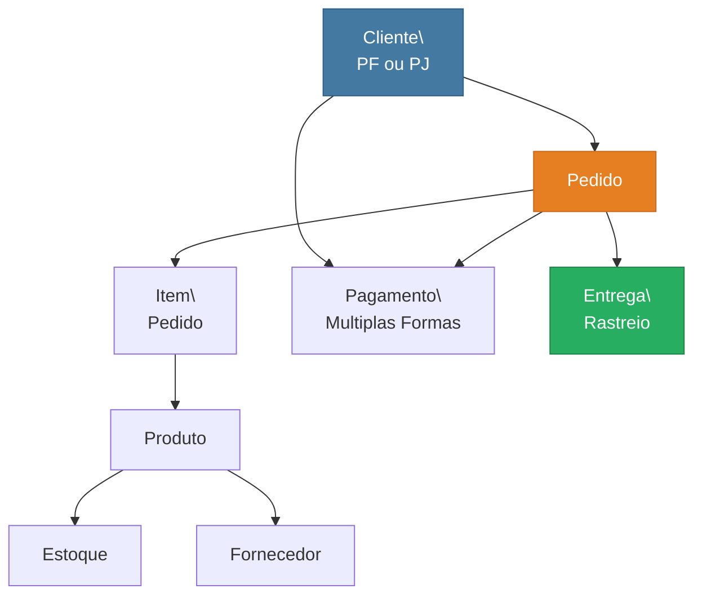

# Refinando um Projeto Conceitual de Banco de Dados - E-Commerce

**[PT-BR](#sobre-o-projeto) | [English](#about-the-project)**

---

## Sobre o Projeto

> Desafio de projeto da **Formacao SQL Database Specialist** -- [DIO (Digital Innovation One)](https://www.dio.me/)

Este repositorio contem o esquema conceitual refinado de um banco de dados para um cenario de E-Commerce, aplicando conceitos avancados de modelagem como especializacao/generalizacao (EER), relacionamentos N:M e restricoes de integridade.

---

## Modelo Conceitual

---

## Refinamentos Implementados

- **Cliente PJ e PF**: Especializacao disjunta e total -- uma conta e PJ ou PF, nunca ambas
- **Pagamento**: Um cliente pode cadastrar multiplas formas de pagamento (cartao, boleto, PIX)
- **Entrega**: Cada pedido possui informacoes de entrega com status e codigo de rastreio

## Entidades

Cliente, ClientePF, ClientePJ, Produto, Pedido, ItemPedido, Pagamento, Entrega, Estoque, ProdutoEstoque, Fornecedor, Vendedor

## Aplicacao na Industria

A modelagem conceitual e a etapa fundamental de qualquer projeto de banco de dados, garantindo que o sistema atenda aos requisitos de negocio antes da implementacao fisica.

---

## English

### About the Project

> Project challenge from the **SQL Database Specialist** program -- [DIO](https://www.dio.me/)

This repository contains the refined conceptual schema of an E-Commerce database, applying advanced modeling concepts such as specialization/generalization (EER), N:M relationships, and integrity constraints.

### Key Refinements

- **PJ and PF Clients**: Total and disjoint specialization
- **Payment**: Multiple payment methods per customer
- **Delivery**: Order tracking with status and tracking code

---

## Licenca | License

Este projeto esta licenciado sob a [Licenca MIT](LICENSE). | This project is licensed under the [MIT License](LICENSE).

---

Developed by [Gabriel Demetrios Lafis](https://github.com/galafis)
